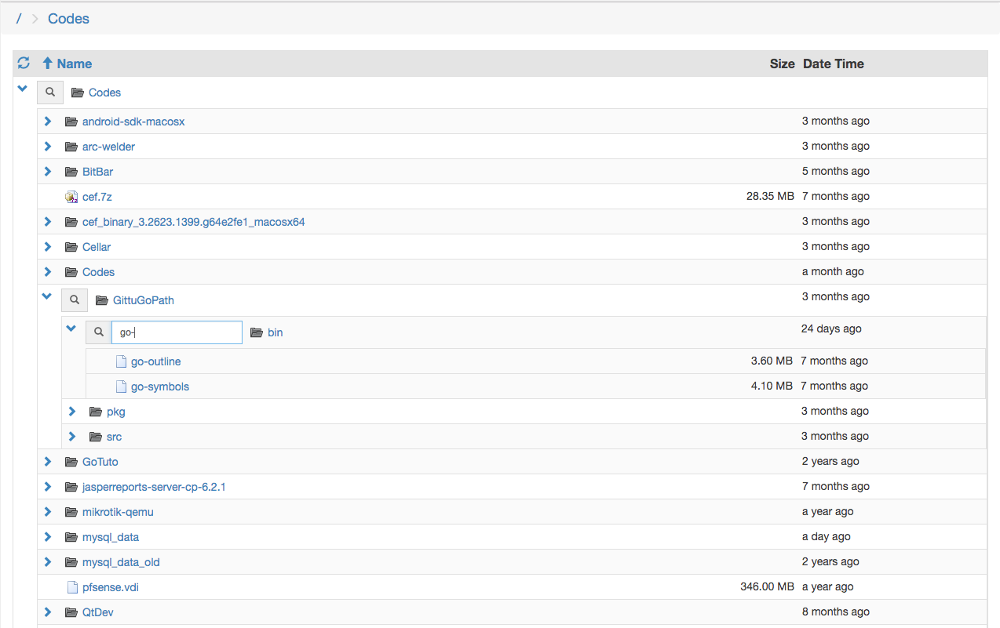

# nginx-vue-index
Uber fancy directory listing/browsing for nginx using vue.js

## Features

Lets take a took at it.



0. Open directories in place like a tree like view. Like macOS Finder.
0. Fuzzy search indvidual directory nodes.
0. Sort By name, size and date.
0. Uses ajax to load directory list.
0. Navigate using breadcrumb or browser's back/forward button (powered by html5 history api);


## Installation

Nginx Config

```
server {
    listen       8080;
    server_name  localhost;

    root /Volumes/Storage;
    index ..............;
    
    autoindex on;
    autoindex_format jsonp;
    autoindex_localtime on;
    
    set $is_json 0;
    if ($args = "j") {
        set $is_json 1;
    }

    location ~ /$ {
        if ($is_json = 0) {
            rewrite / /vueindex/index.html break;
        }
    }
}
```

Clone the repo to document root and run bower.

``` sh
cd /Volumes/Storage
git clone https://github.com/sarim/nginx-vue-index vueindex
cd vueindex
bower install
```

Now nagivate to [localhost:8080](http://localhost:8080) and you'll see directory listing of `/Volumes/Storage`

## Requirements
* **nginx**: Though i'm using nginx to serve the app and `nginx autoindex` module's json listing to provide data, the app has no hard requirement to nginx. App will run as long it gets json data in same format.
* **bower**: for installing libraries.